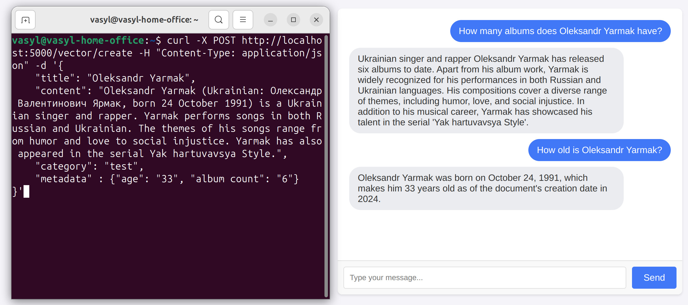

## Ragman - is an open source AI powered chatbot, that provides the possibility to include your custom documents (RAG) in order to achive context specific question answering. 



## Features
### Documents
- Document indexing: Documents are sent to specific endpoint where the are chunked into semantic pieces, normalized, and saved to postgresql database as vector data.
- Document search by similarity: User prompt is converted to vector and the search of similar documents is performed.
- Document categorization: Documents are supplied with a category attribute as well as metadata (document attributes like creatiin date, title, etc.) that are supposed to increase the quality of conversational context.
- Document ebedding: Similar documents are embedded into user prompt and sent to OpenAI completion API.
### Chat
- Chat interface: Simple chat iterface, where you can have your conersation with LLM.
- Coversation history: The app keeps conversation history in database in order to preserve a better context. 
  Prevoius messages that were created in the last 24 hours are sent to completion API.
- Conversation category/topic: You can choose a category/topic of conversation. This affects on the document retrieval process as documnents are supplied with category during indexing.
  This allows you to build a different document collections on different topics.

## Installation

### 1. Prerequisites
- Obtain an API Key from OpenAI at https://platform.openai.com.
- Make sure you OpenAIs [credit balance](https://platform.openai.com/settings/organization/billing/overview) is positive.

### 2. Clone repo
If using GitHub:
```bash
git clone https://github.com/patronik/ragman.git
cd ragman
```
### 3. Configure the Environment
Add top level configuration to root `.env` file
```
EMBEDDING_APP_PORT=<YOUR EMBEDDING_APP_PORT>
CHAT_APP_PORT=<YOUR CHAT_APP_PORT>
POSTGRESS_USERNAME=<YOUR POSTGRESS_USERNAME>
POSTGRESS_PASSWORD=<YOUR POSTGRESS_PASSWORD>
POSTGRESS_DBNAME=<YOUR POSTGRESS_DBNAME>
```
Configure `./embedding/src/config/default.yml` according to template.
```yml
port: 5000
openai:
  api_key: "<YOUR API KEY>"  
  embedding_model: "text-embedding-ada-002"
embedding_dimension: 1536
chunk_overlap: 1
postgres:
  hostname: "<YOUR POSTGRESQL DB HOSTNAME>"
  port: "<YOUR POSTGRESQL DB PORT>"
  username: "<YOUR POSTGRESQL DB USERNAME>"
  password: "<YOUR POSTGRESQL DB PASSWORD>"
  dbname: "<YOUR POSTGRESQL DB NAME>"
```
Configure `./chatbot/src/config/default.yml` according to template.
```yml
port: 4000
embedding:
  api_url: "http://embedding-app:5000"
openai:
  api_key: "<YOUR OPENAI API KEY>"
  completion_model: "gpt-4"
chat:
  messages:
    test:
      system: |
        You are a professional assistant designed to help users find answers to their general questions. 
        Your primary task is to combine retrieved information from the document database with your knowledge 
        to provide comprehensive and accurate answers.
        Follow these guidelines:
        - Utilize Retrieved Documents: Whenever documents are retrieved, prioritize their content to ensure responses are grounded in the most relevant and up-to-date information.
        - Blend with Generative Responses: Integrate the retrieved information smoothly into your answers. Use your knowledge to add context, examples, or actionable advice that complements the retrieved content.
        - Do not mention provided documents in response. Use documents only for information lookup.
        - Fallback for Missing Data: If no relevant documents are available, provide a general response based on your knowledge. Clarify that the answer is based on general insights rather than specific retrieved data.
        - Clarify Ambiguities: If the user query doesn’t match the retrieved documents well, either ask clarifying questions or explain the limitations of the retrieved information before proceeding.
        - Refine Relevance: Suggest query modifications to help users retrieve more targeted results from the database if the initial documents don’t address their needs adequately.
        - Please determinte the language of user prompt and respond in that language.
        Always focus on providing practical, actionable, and contextually appropriate advice to support the user's job search goals.
      prompt: "User Query: %s"
      document: | 
        Retrieved Documents:
        
        %s
        
        Use this information to respond to the user's query.        
  document:
    limit: 5
postgres:
  hostname: "<YOUR POSTGRESQL DB HOSTNAME>"
  port: "<YOUR POSTGRESQL DB PORT>"
  username: "<YOUR POSTGRESQL DB USERNAME>"
  password: "<YOUR POSTGRESQL DB PASSWORD>"
  dbname: "<YOUR POSTGRESQL DB NAME>"
```
## Run
### 1.Execute the following command in a project root directory
```
docker-compose up --build
```
or this to run in background
```
docker-compose up -d --build
```
### 3. Send your documents to `http://localhost:5000/vector/create` endpoint
```bash
curl -X POST http://localhost:5000/vector/create -H "Content-Type: application/json" -d '{
    "title": "Oleksandr Yarmak",
    "content": "Oleksandr Yarmak (Ukrainian: Олександр Валентинович Ярмак, born 24 October 1991) is a Ukrainian singer and rapper. Yarmak performs songs in both Russian and Ukrainian. The themes of his songs range from humor and love to social injustice. Yarmak has also appeared in the serial Yak hartuvavsya Style.",
    "category": "test",
    "metadata" : {"age": "33", "album count": "6"}
}'
```
Make sure that document category messages are configured in chatbot app configuration. See example:
```yaml
chat:
  messages:
    chat_category: 
      system: "System message that contains general LLM instructions."
      prompt: "User Query: %s."
      document: "Documents: %s."

```
### 2. Go to `http://localhost:4000` to start chat conversation
## License
This project is licensed under the MIT License.
